# FASE 6 — DESENVOLVIMENTO

## 6.1 Padrão do sistema

Nesta seção, o padrão do sistema é entendido como a distribuição das responsabilidades necessárias para executar a plataforma. A Nossa Causa foi desenvolvida como uma aplicação web em um monorepo TypeScript. A interface web ocupa um módulo próprio e compartilha com os módulos de autenticação, procedimentos remotos, validação e persistência os contratos necessários à comunicação. Essa divisão organiza o código por responsabilidade e permite que a interface apresente ações adequadas a cada pessoa usuária sem assumir sozinha decisões relacionadas a permissões ou ao estado das campanhas.

O sistema apresenta uma organização cliente-servidor com responsabilidades separadas, identificada na análise da implementação. No navegador, as páginas exibem campanhas, perfis, configurações e painéis de gestão. Os formulários relacionados às campanhas e ao perfil de organizador comunicam-se com procedimentos tipados, enquanto os fluxos de autenticação e parte da manutenção da conta utilizam a interface própria do serviço de autenticação. Nos dois caminhos, os dados são verificados durante a interação de acordo com as regras de cada formulário. Nas ações restritas, a sessão também é conferida antes da execução e o usuário é identificado para que as regras sejam avaliadas no lado protegido da aplicação. O Quadro 4 resume essas responsabilidades e explicita seus limites no MVP.

Quadro 4 — Responsabilidades na implementação do MVP Nossa Causa

| Responsabilidade | Implementação no MVP | Limite da responsabilidade |
| --- | --- | --- |
| Interface web | Organiza rotas, páginas, componentes, formulários, mensagens de retorno e consultas apresentadas no navegador. | Não define isoladamente quem pode alterar uma campanha ou quais dados podem ser gravados. |
| Comunicação e estado da interface | Realiza consultas e mutações por procedimentos tipados e atualiza os dados exibidos depois de operações que modificam campanhas, perfis ou participações. | A atualização visual não substitui a conferência das regras no servidor. |
| Autenticação e autorização | Mantém a sessão e protege as rotas e operações que dependem de acesso autenticado. | A autenticação identifica o usuário, mas cada operação ainda verifica se ele pode agir sobre o recurso solicitado. |
| Validação e regras de negócio | Confere formatos, campos obrigatórios, modalidade, período e condições de cada operação. Também aplica regras de propriedade, participação, ciclo de vida e prestação de contas. | A validação de dados não equivale à auditoria das declarações feitas por organizadores. |
| Persistência e arquivos | Registra usuários, perfis, campanhas, participações, atualizações e prestações de contas no banco de dados. Imagens de campanhas e evidências são tratadas por serviços próprios de envio e publicação. | Não processa pagamentos nem controla a entrega, o estoque ou a distribuição de donativos. |
| Serviços de conta | Apoiam verificação de endereço de e-mail, recuperação de acesso e métodos de autenticação disponíveis. | Não correspondem a um sistema de notificações de campanhas. |

Fonte: elaboração própria com base na implementação do MVP Nossa Causa (2026).

As consultas públicas seguem um fluxo separado das ações de gestão. Ao pesquisar campanhas, por exemplo, a interface envia os filtros de tema, região e modalidade para uma operação pública. A aplicação valida esses critérios, consulta as campanhas disponíveis no período e devolve apenas as informações necessárias à listagem. No detalhe de uma campanha, o mesmo princípio preserva as informações públicas do organizador, das atualizações, dos pontos de coleta e, quando houver, da prestação de contas. Assim, a página apresenta dados preparados para a consulta sem expor dados de sessão ou operações de administração.

O fluxo de criação de uma campanha mostra como as responsabilidades se complementam nas ações autenticadas. O organizador informa os dados no formulário e seleciona a modalidade física ou virtual. A interface ajusta os campos conforme essa escolha e confere os dados antes do envio. No lado protegido, a aplicação confirma a sessão, verifica a existência do perfil de organizador e valida novamente a solicitação. Depois disso, aplica as regras do período e da modalidade. Uma campanha física registra meta e pontos de coleta; uma campanha virtual registra a chave PIX ou os dados bancários informados pelo organizador. A operação grava esses dados de forma consistente e, quando houver imagem, coordena o envio do arquivo antes de associá-lo à campanha.

A repetição de validações em pontos diferentes tem funções distintas. Na interface, ela orienta o preenchimento e apresenta erros ao usuário. Nos procedimentos da aplicação, ela impede que uma solicitação recebida fora da tela ou alterada durante o envio seja aceita sem atender às regras; a validação no lado protegido é necessária porque controles no navegador podem ser contornados (OWASP, s.d.a). A autorização segue a mesma lógica. Uma tela pode mostrar a opção de edição para o organizador, mas a operação de alteração também confere o vínculo entre o usuário e a campanha. Dessa forma, a proteção não depende apenas de quais botões estão visíveis no navegador (OWASP, s.d.b).

As regras de negócio permanecem próximas às operações que alteram o domínio. Esse conjunto inclui a criação e a edição de campanhas, a participação em campanhas físicas, o registro de progresso, a publicação de atualizações, as transições de estado e a prestação de contas. As operações que modificam informações persistentes são executadas com controle de consistência. A atualização do estado exibido pela interface ocorre depois da conclusão dessas operações, para que as listas, os detalhes da campanha e o painel do organizador voltem a consultar os dados atuais.

Essa organização corresponde ao diagrama de implementação apresentado na Fase 4: a interface trata a interação, os procedimentos e serviços concentram regras e permissões, a autenticação identifica o usuário, a validação confere os dados e a persistência preserva os registros. A separação observada é de responsabilidades; por isso, o sistema não é caracterizado como MVC apenas pela presença de páginas e dados. Também permanecem os limites do MVP. A Nossa Causa divulga informações para transferências virtuais, mas não recebe, confirma ou concilia pagamentos. Da mesma forma, a plataforma registra informações e evidências das campanhas, sem executar a logística dos itens ou auditar externamente as prestações de contas declaradas.

## 6.2 Lista de telas de entrada, consulta e relatório

O levantamento do MVP identificou quinze telas visuais. Foram consideradas as páginas acessadas pelas pessoas usuárias e as duas abas de configurações, pois cada uma reúne funções próprias. Rotas de API, estruturas de layout, telas de carregamento, mensagens de erro e diálogos de confirmação não foram contabilizados como telas autônomas. Páginas parametrizadas, como o detalhe, o painel e a edição de uma campanha, representam uma tela por finalidade, ainda que atendam campanhas diferentes. O Quadro 5 relaciona as telas, o tipo de acesso, sua classificação predominante e as variações relevantes.

Quadro 5 — Telas de entrada, consulta e relatório do MVP Nossa Causa

| Tela | Acesso | Classificação predominante | Finalidade e variações relevantes |
| --- | --- | --- | --- |
| Início | Público, com apresentação adaptada à sessão autenticada | Consulta | Apresenta a proposta da plataforma, as modalidades de campanha e os caminhos para explorar campanhas, criar conta ou iniciar uma campanha. |
| Campanhas | Público, com ações adicionais na sessão autenticada | Consulta e entrada de filtros | Lista campanhas disponíveis e permite filtrar por tema, região e modalidade. |
| Detalhe da campanha | Público, com participação disponível a usuários autenticados em campanhas físicas ativas | Consulta e relatório integrado | Exibe dados da campanha, do organizador, dos pontos de coleta ou dados de transferência, atualizações e, quando publicada, a prestação de contas. |
| Entrar | Anônimo | Entrada | Permite acesso por credenciais, conta vinculada ou chave de acesso quando esses métodos estão disponíveis. |
| Criar conta | Anônimo | Entrada | Exibe o formulário de cadastro por nome, e-mail e senha quando o cadastro está habilitado; caso contrário, informa sua indisponibilidade. |
| Esqueci minha senha | Anônimo | Entrada | Solicita o envio de um link para redefinição de senha. |
| Redefinir senha | Pessoa portadora de link com token | Entrada | Exibe o formulário para definir uma nova senha; a validade do token é conferida no envio. |
| Minhas participações | Autenticado | Consulta | Reúne as campanhas físicas ativas das quais a pessoa usuária está participando. |
| Minhas campanhas | Autenticado | Consulta | Lista as campanhas administradas pela pessoa usuária; sem perfil organizador, apresenta um estado vazio. |
| Painel da campanha | Organizador proprietário | Consulta, entrada e relatório integrado | Permite acompanhar status, participantes e progresso, publicar atualizações, encerrar ou cancelar a campanha e registrar a prestação de contas após a conclusão. Também mostra a visualização pública atual. |
| Editar campanha | Organizador proprietário | Entrada | Exibe o formulário para campanhas pendentes ou ativas; nos demais estados, informa que a edição não está disponível. |
| Criar campanha | Autenticado | Entrada | Exibe o formulário de campanha física ou virtual quando a pessoa usuária possui perfil organizador; caso contrário, orienta sua configuração. |
| Perfil organizador | Autenticado | Entrada | Cria ou atualiza o perfil individual ou institucional que identifica quem organiza campanhas. |
| Configurações — Conta | Autenticado | Entrada e consulta | Reúne dados de perfil, imagem, e-mail, nome de usuário e contas vinculadas. |
| Configurações — Segurança | Autenticado | Entrada e consulta | Reúne definição ou alteração de senha, chaves de acesso e sessões ativas. |

Fonte: elaboração própria com base na implementação do MVP Nossa Causa (2026).

As telas de consulta podem conter controles de entrada sem perder sua finalidade principal. O catálogo, por exemplo, recebe filtros para refinar a listagem, enquanto o detalhe da campanha apresenta informações já registradas e oferece participação apenas na situação aplicável. As abas de configurações foram relacionadas separadamente porque os dados de conta e os mecanismos de segurança são administrados em conjuntos distintos.

Não há uma tela exclusiva de relatório no MVP. A prestação de contas é preenchida no painel da campanha concluída e aparece no detalhe público quando foi publicada. Por esse motivo, ela foi classificada como relatório integrado a essas duas telas, sem atribuir ao sistema uma página ou um gerador de relatórios inexistente.

## 6.2.1 Imagens de cada formulário do software

Foram registradas dezenove unidades de entrada de dados do MVP em uma execução local da aplicação. As capturas foram produzidas em tema claro e viewport de desktop, com o Chrome DevTools MCP. Os dados exibidos pertencem a uma conta e a campanhas fictícias preparadas apenas para a documentação; nenhuma credencial, token válido, dado bancário real ou dado pessoal foi informado ou submetido durante o registro.

As Figuras 4 a 8 mostram os controles acessíveis sem sessão autenticada. Os filtros do catálogo são incluídos porque permitem informar critérios de consulta. A redefinição de senha foi aberta com um identificador fictício, sem tentar alterar uma senha, pois o objetivo é demonstrar os campos visíveis, não executar o fluxo de recuperação.

Figura 4 — Filtros de campanhas

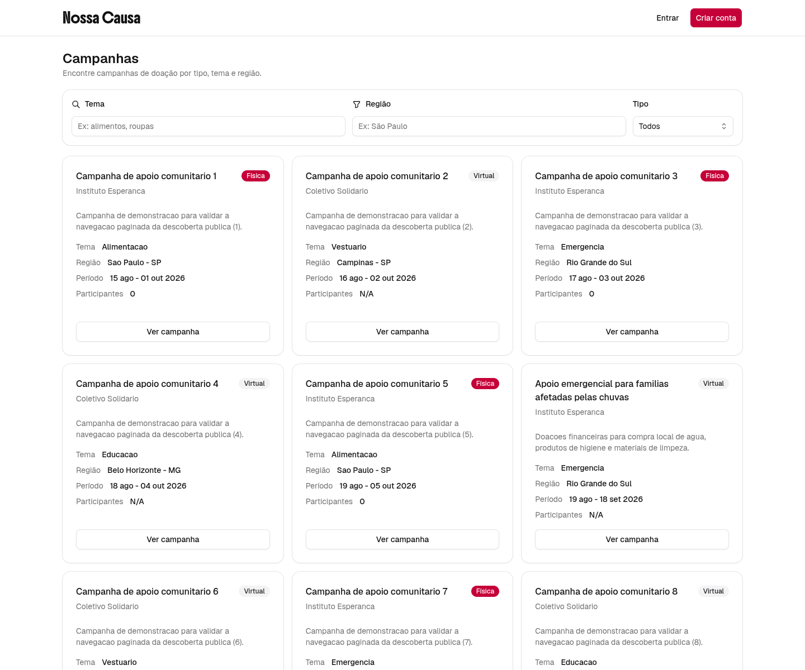

Fonte: elaboração própria a partir da aplicação Nossa Causa, com dados fictícios (2026).

Figura 5 — Entrada na conta

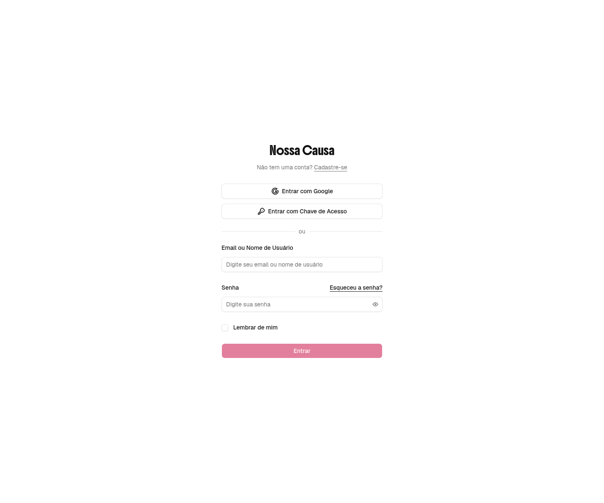

Fonte: elaboração própria a partir da aplicação Nossa Causa, com dados fictícios (2026).

Figura 6 — Criação de conta

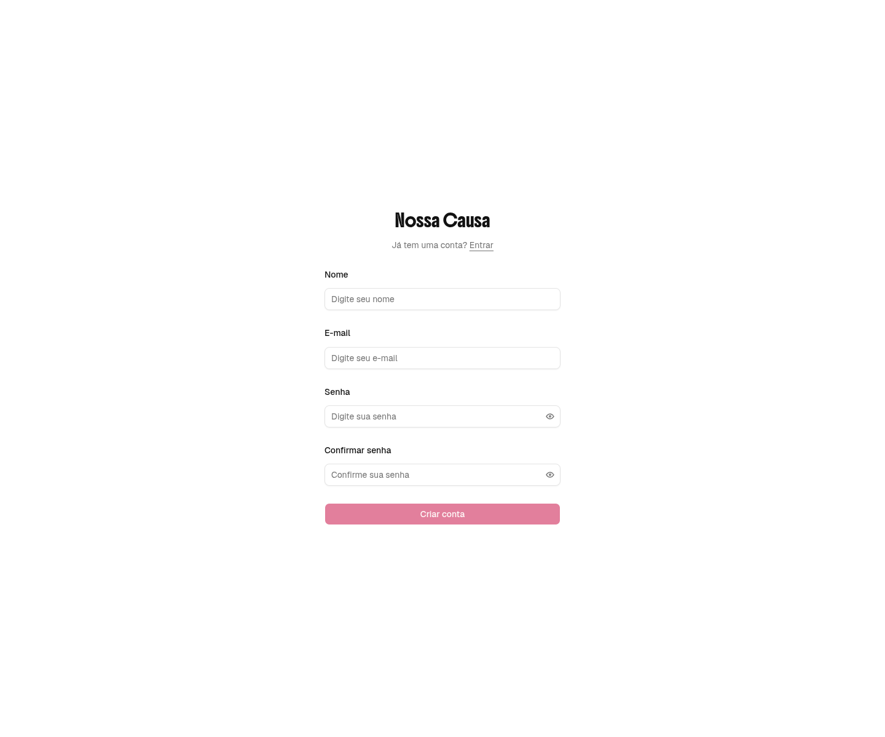

Fonte: elaboração própria a partir da aplicação Nossa Causa, com dados fictícios (2026).

Figura 7 — Solicitação de redefinição de senha

Fonte: elaboração própria a partir da aplicação Nossa Causa, com dados fictícios (2026).

Figura 8 — Redefinição de senha

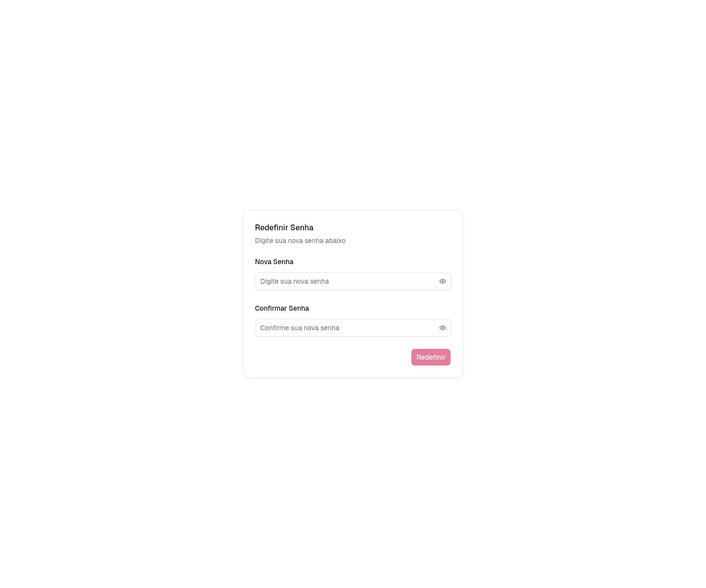

Fonte: elaboração própria a partir da aplicação Nossa Causa, com dados fictícios (2026).

As Figuras 9 a 14 concentram os formulários de organizador e de campanha. A comparação entre os estados físico e virtual torna visíveis os campos condicionais de cada modalidade, sem alterar o escopo funcional descrito nas fases anteriores.

Figura 9 — Perfil de organizador institucional

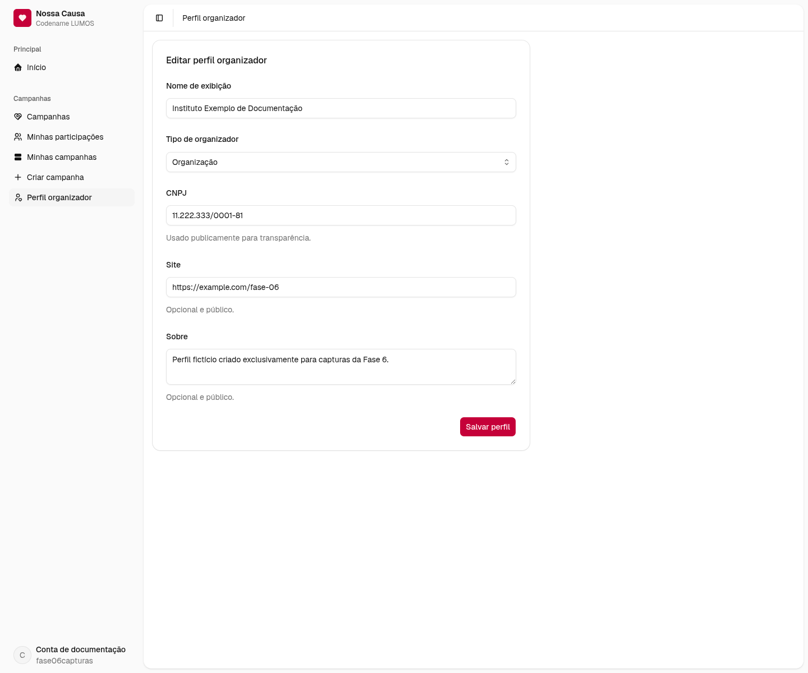

Fonte: elaboração própria a partir da aplicação Nossa Causa, com dados fictícios (2026).

Figura 10 — Criação de campanha física

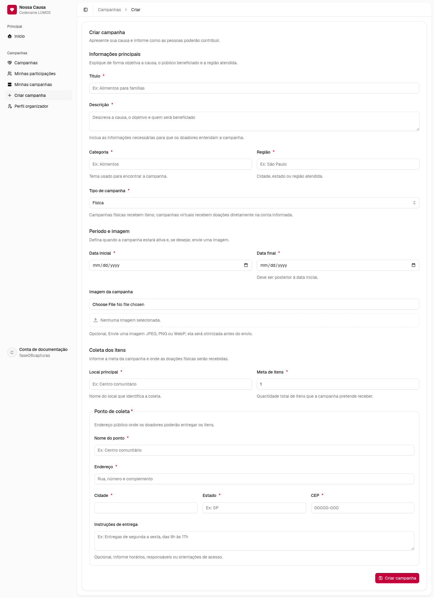

Fonte: elaboração própria a partir da aplicação Nossa Causa, com dados fictícios (2026).

Figura 11 — Criação de campanha virtual

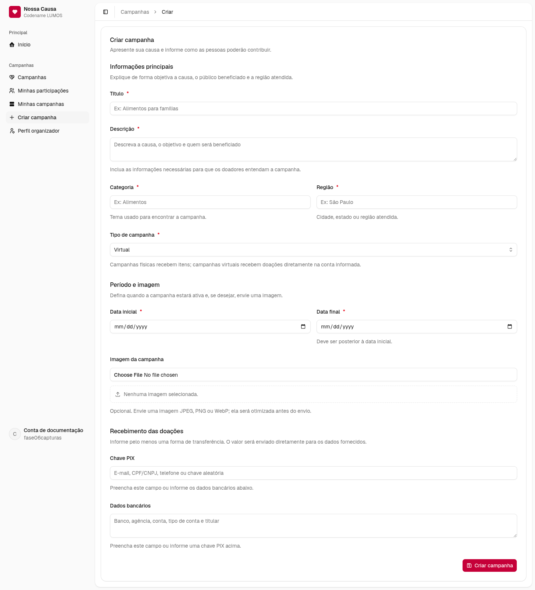

Fonte: elaboração própria a partir da aplicação Nossa Causa, com dados fictícios (2026).

Figura 12 — Edição de campanha física

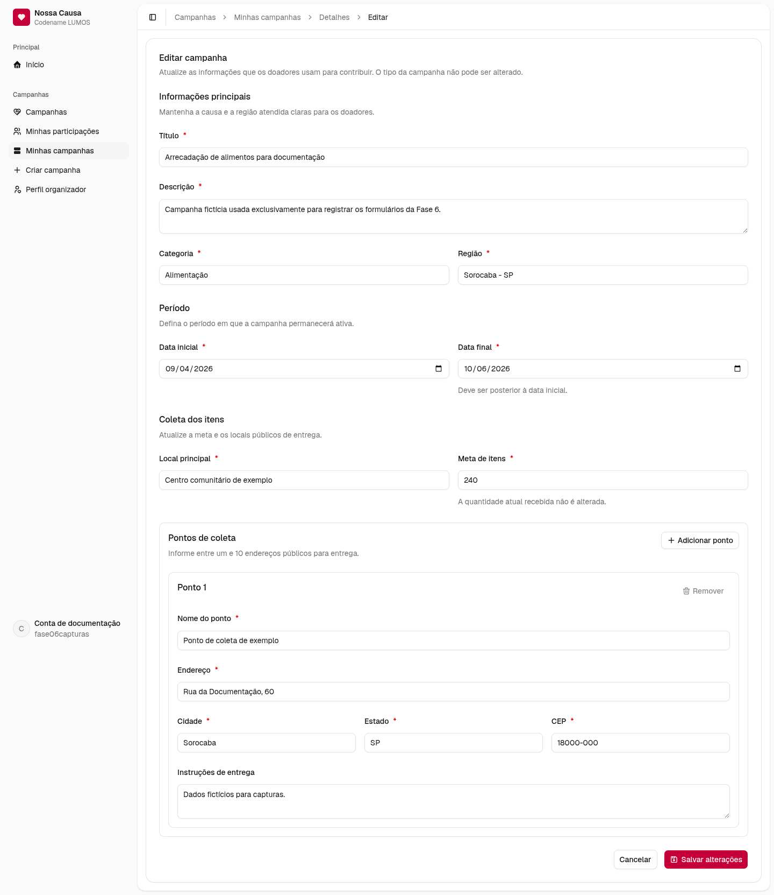

Fonte: elaboração própria a partir da aplicação Nossa Causa, com dados fictícios (2026).

Figura 13 — Edição de campanha virtual

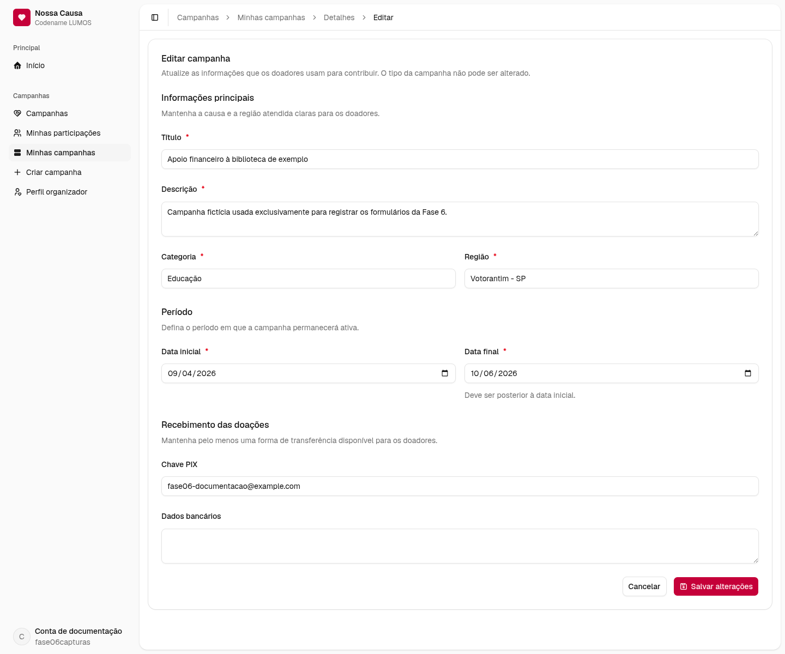

Fonte: elaboração própria a partir da aplicação Nossa Causa, com dados fictícios (2026).

Figura 14 — Registro de progresso de itens

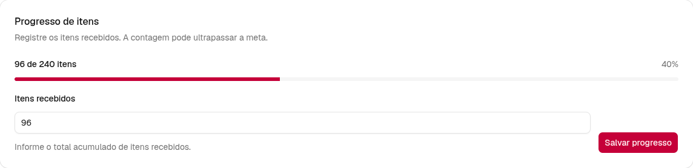

Fonte: elaboração própria a partir da aplicação Nossa Causa, com dados fictícios (2026).

As Figuras 15 a 17 registram operações realizadas durante e depois do ciclo de vida de uma campanha. A atualização comunica uma novidade aos doadores, enquanto os formulários de prestação de contas exigem um resumo e permitem anexar evidências. A modalidade física pede o total de itens; a virtual pede o total arrecadado, coerente com as características de cada campanha.

Figura 15 — Publicação de atualização de campanha

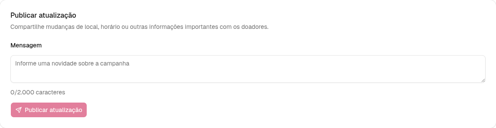

Fonte: elaboração própria a partir da aplicação Nossa Causa, com dados fictícios (2026).

Figura 16 — Prestação de contas de campanha física

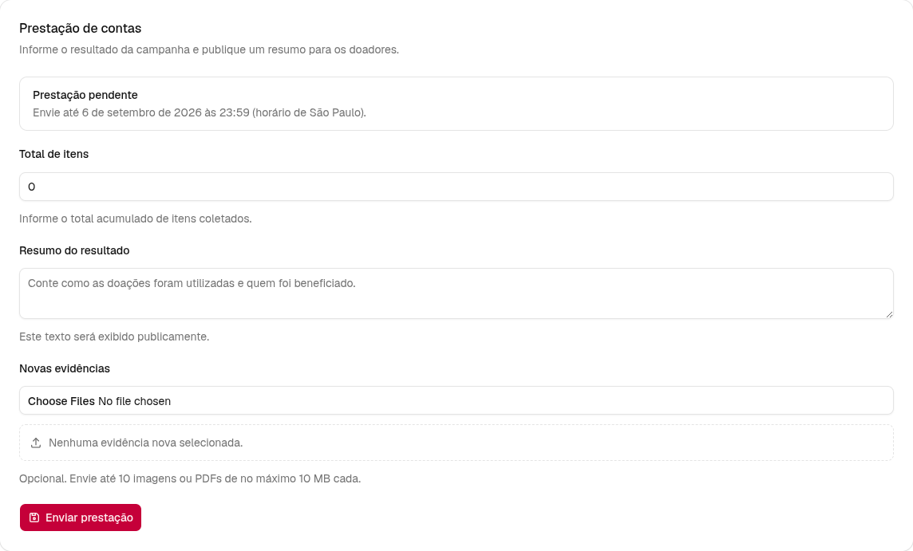

Fonte: elaboração própria a partir da aplicação Nossa Causa, com dados fictícios (2026).

Figura 17 — Prestação de contas de campanha virtual

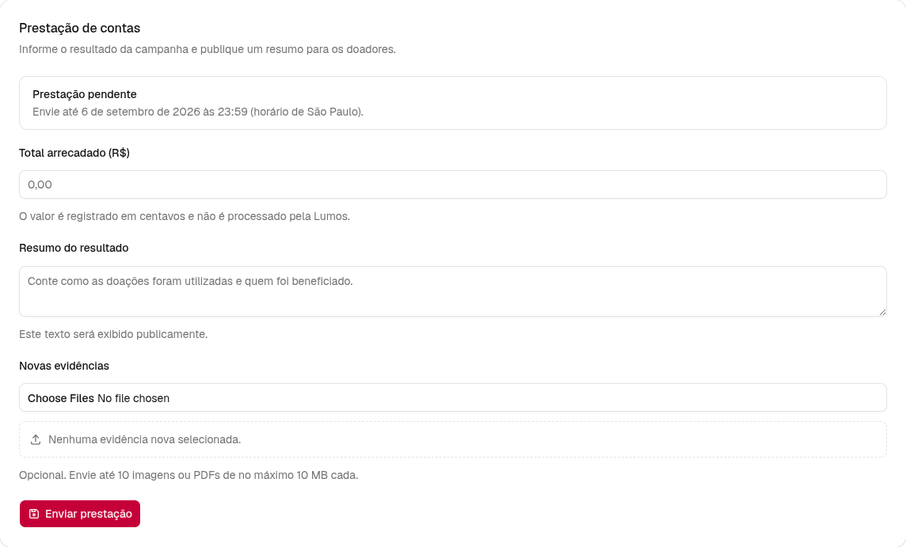

Fonte: elaboração própria a partir da aplicação Nossa Causa, com dados fictícios (2026).

As Figuras 18 a 22 apresentam a manutenção da conta. Os diálogos foram registrados abertos para evidenciar as unidades de entrada que não ocupam uma página inteira. O cadastro de chave de acesso não foi confirmado, porque sua conclusão exige a interação da pessoa usuária com um autenticador compatível e não é necessária para apresentar o formulário (W3C, 2026, seção 6.3.2).

Figura 18 — Dados básicos da conta

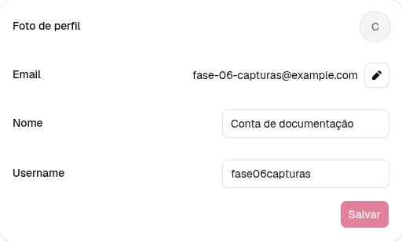

Fonte: elaboração própria a partir da aplicação Nossa Causa, com dados fictícios (2026).

Figura 19 — Alteração de avatar

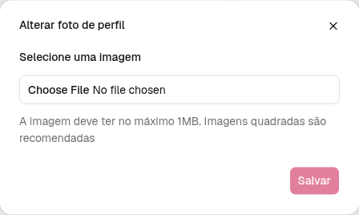

Fonte: elaboração própria a partir da aplicação Nossa Causa, com dados fictícios (2026).

Figura 20 — Alteração de endereço de e-mail

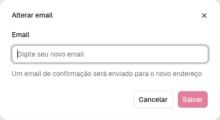

Fonte: elaboração própria a partir da aplicação Nossa Causa, com dados fictícios (2026).

Figura 21 — Alteração de senha

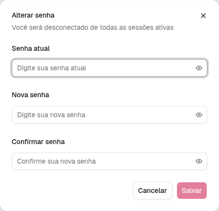

Fonte: elaboração própria a partir da aplicação Nossa Causa, com dados fictícios (2026).

Figura 22 — Registro de chave de acesso

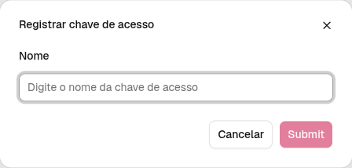

Fonte: elaboração própria a partir da aplicação Nossa Causa, com dados fictícios (2026).

As imagens documentam as entradas disponíveis no snapshot da aplicação e suas variações relevantes; não constituem um manual de uso nem comprovam a realização de doações, transferências ou prestações de contas. Durante a diagramação final, os arquivos originais poderão ser organizados em pranchas para preservar a legibilidade, sem eliminar a identificação individual de cada formulário.

## 6.2.2 Diagrama de classe

O diagrama de classe apresenta uma visão estática de uma parte do sistema. Ele reúne os elementos estruturais selecionados, seus atributos, suas operações e os relacionamentos entre eles. A especificação da UML descreve classes, propriedades, operações e associações como elementos dessa representação; as multiplicidades indicam quantas instâncias podem participar de um vínculo (OBJECT MANAGEMENT GROUP, 2017). A notação adotada na figura foi produzida em Mermaid, cuja sintaxe distingue atributos de operações, relações e anotações de classe (MERMAID, s.d.a).

A Nossa Causa foi implementada principalmente com funções TypeScript, tipos inferidos e esquemas de validação, e não com uma hierarquia manual de classes de domínio. Por isso, a figura usa o título exigido para o diagrama de classe, mas explicita a natureza de cada elemento por estereótipos. As caixas de entidades persistidas correspondem aos registros do domínio; as de tipos validados representam contratos de entrada; e as de módulos funcionais reúnem procedimentos e serviços. Esses dois últimos grupos não são apresentados como classes concretas da linguagem.

Figura 23 — Estrutura de entidades, contrato e operações do domínio de campanhas da Nossa Causa

Fonte: elaboração própria a partir da implementação do MVP Nossa Causa (2026).

A Figura 23 organiza a campanha como elemento central. Seus atributos registram a modalidade, o estado e os dados próprios das campanhas físicas ou virtuais. A relação de composição indica que uma campanha pode ter, no máximo, uma prestação de contas, cujos totais também variam conforme a modalidade.

O recorte também mostra o caminho entre entrada e persistência. O contrato de prestação de contas depende da modalidade da campanha, pois o total informado muda entre campanhas físicas e virtuais. Os procedimentos recebem esse contrato e acionam serviços que aplicam regras e registram alterações; a criação, a edição e as transições do ciclo de vida aparecem como operações do mesmo conjunto. Assim, a figura acrescenta um contrato e dependências operacionais à visão de entidades apresentada no DER, em vez de apenas repetir seus relacionamentos.

## 6.2.3 Documentação do código com TSDoc

TSDoc foi adotado como alternativa tecnológica a JAVADOC ou SUMMARY previstos na estrutura original do trabalho. Como convenção para comentários de documentação em TypeScript, ele organiza informações sobre APIs sem substituir a ferramenta que interpreta, verifica ou apresenta esses comentários (TSDOC, s.d.a; TSDOC, s.d.b). Cada comentário começa por um resumo breve e pode receber detalhes em `@remarks`; `@param` descreve parâmetros, `@returns` descreve retornos e `@throws` registra exceções relevantes (TSDOC, s.d.c; TSDOC, s.d.d; TSDOC, s.d.e; TSDOC, s.d.f).

Conforme a premissa adotada para a Nossa Causa, a documentação se concentra nos pontos em que o contrato ou a regra de domínio precisa ser compreendido fora de sua implementação imediata. Esse recorte inclui contratos compartilhados de validação, funções de calendário das campanhas, procedimentos e serviços associados às campanhas e APIs selecionadas de autenticação. A escolha favorece os módulos reutilizados por diferentes partes da aplicação e as operações que validam, autorizam ou alteram dados persistentes.

Componentes React e rotas visuais não fazem parte dessa cobertura, pois sua leitura depende sobretudo da composição da interface. Também ficaram de fora modelos e clientes gerados, esquemas de persistência, migrações, seeds, scripts de infraestrutura, testes e funções privadas de apoio. A exclusão não indica ausência de manutenção desses elementos; apenas delimita a documentação às interfaces e regras cujo uso se estende além de uma tela ou arquivo.

Neste trabalho, a compatibilidade dos comentários com a convenção adotada integra a premissa definida para o tópico. Nenhuma ferramenta, comando ou saída específica é apresentada como evidência verificada. Esse recorte não substitui a verificação de tipos, não demonstra a execução das regras e não permite concluir que todos os arquivos do monorepo estejam documentados. A Figura 24 permanece reservada à integração final com a única imagem fornecida pelo usuário, acompanhada de título, fonte e interpretação adequados ao seu conteúdo.

Em conjunto, a organização das responsabilidades, o inventário das telas, as evidências visuais, o diagrama de classe e a delimitação do TSDoc mostram como o MVP corresponde ao projeto lógico apresentado na Fase 4. Esta fase se restringe ao desenvolvimento observado e ao recorte documental estabelecido. Implantação, treinamento, segurança operacional e backup permanecem destinados à Fase 7.
